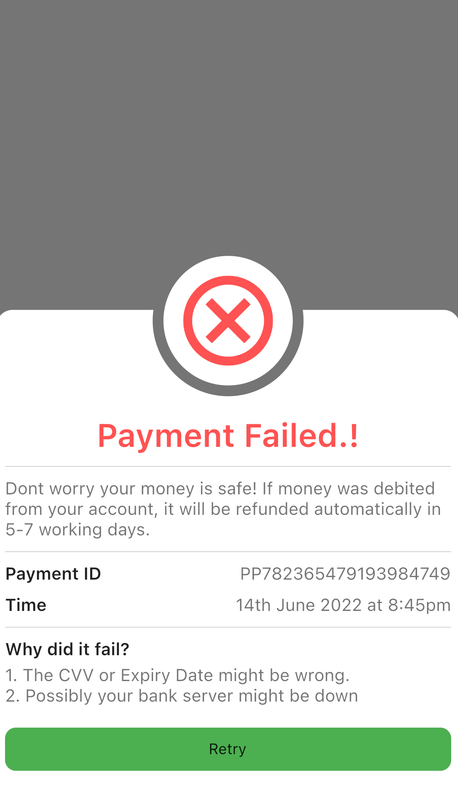
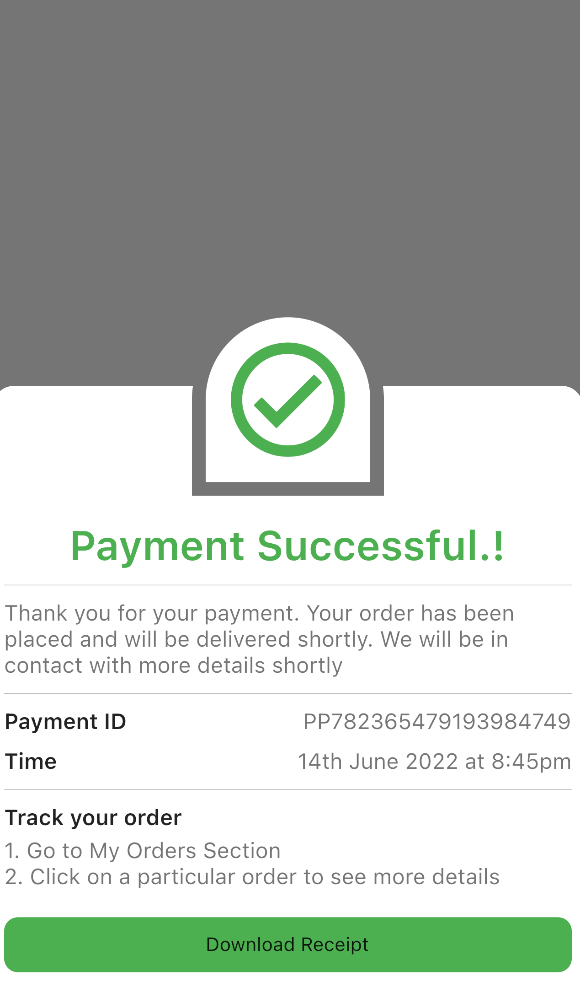
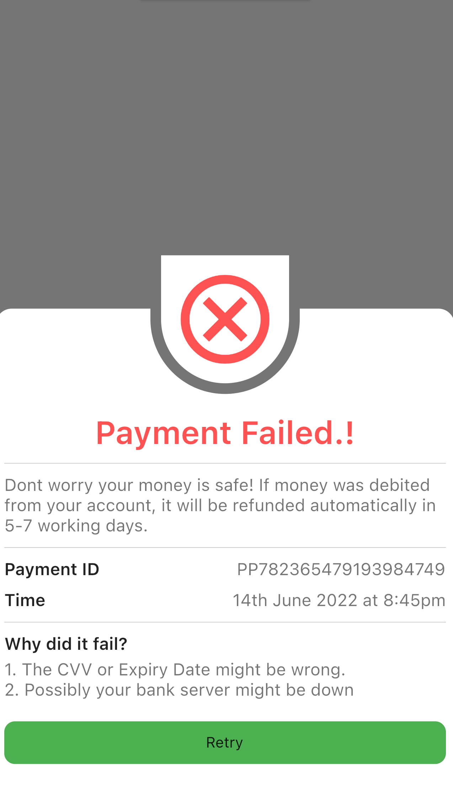
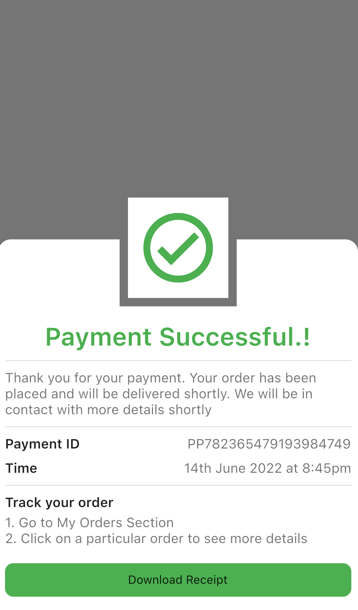

# icon_bottomsheet

This is a customized class for bottomsheet with dynamic icon(widget) on top with various shapes. It uses the default bottomsheet imported from `package:flutter/material.dart`. The IconBottomSheet class then creates a tranaparent border for the iconWidget. The size of the padding is defined by iconPadding. The iconSize is the size of the iconWidget and iconShape is the shape of the iconWidget. There are various shapes for iconWidget as `circle`, `square`, `circleTop`, `circleBottom`. Below are the images for the various iconShapes of IconBottomSheet.


     

   


# Arguments

| Argument           | Description                                                                                       
|--------------------|---------------------------------------------------------------------------------------------------
| child              | This is the child widget that will be displayed in the bottomsheet.                               
| iconWidget         | Widget displayed on top of bottomsheet.                                                
| iconSize           | Height/Width of the iconWidget. Defaults to 50 (height and width are same).
| iconPadding        | Transparent border padding around the iconWidget. Defaults to 16. Use 0 when not requried.

# IconShape

| Argument               | Description                                                                                       
|------------------------|---------------------------------------------------------------------------------------------------
| IconShape.circle       | Creates circle shape background of iconWidget.                               
| IconShape.circleTop    | Creates circle shape from top and square shape from bottom for background of iconWidget.
| IconShape.circleBottom | Creates circle shape from bottom and square shape from top for background of iconWidget.
| IconShape.square       | Creates square shape background of iconWidget.


# Getting started

Add the package `icon_bottomsheet` to your pubspec.yaml file and do pub get.


# Usage

Import showModalBottomSheet from `material.dart` and then import the `IconBottomSheet` from `package:icon_bottomsheet/icon_bottomsheet.dart` and pass the arguments as described above.

```dart
showModalBottomSheet<int>(
    context: context,
    builder: (context) {
    return const IconBottomSheet(
        iconWidget: Icon(
        Icons.cancel_outlined,
        color: Colors.redAccent,
        size: 100,
        ),
        iconShape: IconShape.topCircular,
        iconSize: 120,
        iconPadding: 20,
        child: PaymentFailed(),
    );
    },
);
```

## Contributor
[Amit Mishra](https://github.com/amitmishra7) 

## Contribute 

If you have any ideas for extending this package or have found a bug, please contribute!

1. You'll need a GitHub account.
2. Fork the icon_bottomsheet repository.
3. Work on your feature/bug.
4. Create a pull request.
5. Star this project. ⭐
6. Become a hero!! 🎉
